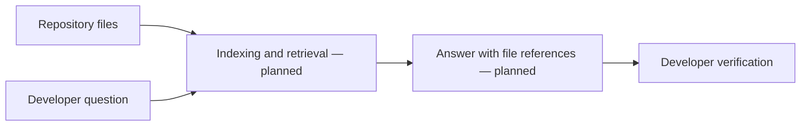

# Codebase Knowledge AI

<strong>A project concept for asking questions about a software repository and receiving answers grounded in its files.</strong>

## Intended workflow

The repository description presents a full-stack AI assistant and includes a demo URL, but the GitHub repository currently contains only README, license, and ignore files. The runnable application source and setup instructions are not present here; the diagram describes the intended product, not verified internals.

## Before presenting it as reproducible

Commit the frontend/backend source or link clearly to its maintained source repository. Document indexing scope, supported languages, data retention, model configuration, and how answers cite their source files.
